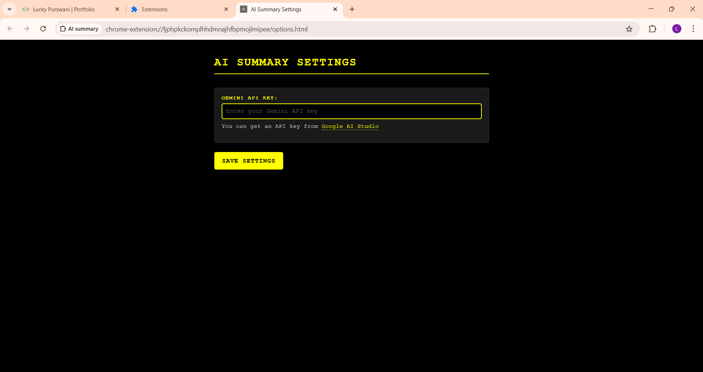

# AI Summary Chrome Extension

## Overview
AI Summary is a Chrome extension powered by Google's Gemini AI that provides instant, customizable summaries of web pages. The extension helps users save time by generating concise summaries of articles, blog posts, and other web content directly in their browser.

## 📸 Screenshots  

<p float="left">
  
  
  
</p> 

## Features
- Multiple summary types:
  - Brief (50-word quick summary)
  - Detailed (structured multi-paragraph analysis)
  - Bullet Points (5-7 key takeaways)
  - Key Insights (focused analysis)
- Clean, modern UI with customizable display
- Copy to clipboard functionality
- Works on most text-based websites
- Automatic content extraction
- Secure API key management

## Installation
1. Clone this repository:
   ```bash
   git clone https://github.com/yourusername/ai-summary-chrome-extension
   ```
2. Open Chrome and navigate to `chrome://extensions/`
3. Enable "Developer mode" in the top right
4. Click "Load unpacked" and select the extension directory
5. Configure your Gemini API key in the extension options

## Setup
1. Get a Gemini API key from [Google AI Studio](https://makersuite.google.com/app/apikey)
2. Click the extension icon and select the settings gear
3. Enter your API key in the options page
4. Save the settings

## Usage
1. Navigate to any webpage you want to summarize
2. Click the AI Summary extension icon
3. Select your preferred summary type:
   - Brief: Quick 50-word overview
   - Detailed: Comprehensive analysis
   - Bullet Points: Key takeaways
   - Key Insights: Main concepts
4. Click "Summarize" to generate
5. Use the "Copy" button to copy the summary

## Technical Details

### File Structure
```
ai-summary-chrome/
├── manifest.json        # Extension configuration
├── popup.html          # Main UI
├── popup.js           # UI logic and API calls
├── content.js         # Webpage text extraction
├── background.js      # Background service worker
├── options.html       # Settings page
└── options.js         # Settings management
```

### Required Permissions
```json
{
    "permissions": [
        "activeTab",     // Access current tab
        "scripting",     // Run content scripts
        "storage"        // Store API key
    ],
    "host_permissions": [
        "<all_urls>"     // Work on any website
    ]
}
```

### Dependencies
- Chrome Browser (v88 or higher)
- Gemini API key
- Active internet connection

## Development

### Local Development
1. Make changes to the source files
2. Go to `chrome://extensions/`
3. Click the refresh icon on the extension card
4. Test your changes

### Building for Production
1. Update version in manifest.json
2. Remove any console.log statements
3. Zip the extension directory
4. Submit to Chrome Web Store

## Contributing
1. Fork the repository
2. Create your feature branch (`git checkout -b feature/AmazingFeature`)
3. Commit your changes (`git commit -m 'Add some AmazingFeature'`)
4. Push to the branch (`git push origin feature/AmazingFeature`)
5. Open a Pull Request

## License
This project is licensed under the MIT License - see the LICENSE file for details

## Acknowledgments
- Google Gemini AI for providing the summarization capabilities
- Chrome Extensions documentation
- Contributors and testers
